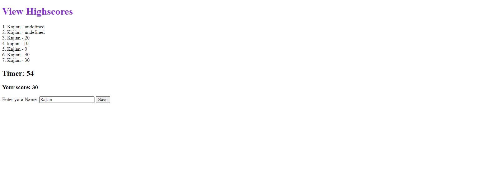

# Kajian-Code-Quiz
Website Made by Kajian Pulenthirasingam

My first Code Quiz. I had the challenge of making my first code quiz. When you open thr side press the start button to start the game. You will be asked three questions one by one. If you answer the question correctly, it does not affect the time and it increases your score. If you answer incorrectly, it will affect the time and decrease your score. If the timer runs out the game will end. Once you finish the game it will ask for your Initials that will be stored into the local storage. For installing my project you just need to clone this code to your repository. Project by Kajian Pulenthirasingam

The link to the project: https://kajianpulenthirasingam.github.io/Kajian-Code-Quiz/
The link to the repository: https://github.com/kajianpulenthirasingam/Kajian-Code-Quiz

